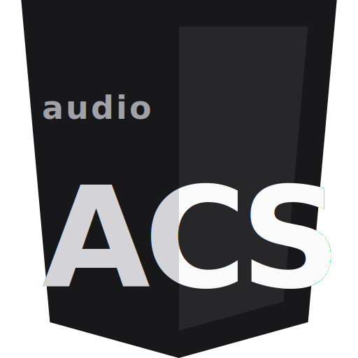

<div align="center">



# ACS — Audio Cascading Style Sheets

**Declarative audio for the web. Same selectors and cascade as CSS,
properties target sound.**

[](LICENSE)
[](CHANGELOG.md)
[](package.json)
[](https://marketplace.visualstudio.com/items?itemName=audio-cascading-style-sheets.acs-language)
[](https://open-vsx.org/extension/audio-cascading-style-sheets/acs-language)

[**audiocss.dev**](https://audiocss.dev) · [Docs](https://audiocss.dev/docs/) · [Quick start](#quick-start) · [Install](#install) · [Examples](#examples) · [VSCode extension](#vscode-extension) · [Browser support](#browser-support)

</div>

---

## What it is

CSS describes how an HTML element should look. **ACS describes how it
should sound.** Same selectors. Same cascade. Properties target audio:

```css
:root            { master-volume: 0.85; room: medium-room; }

button           { sound-on-click: tap-tactile; }
button.primary   { sound-on-click: pop;     pitch: +1st; }
button.danger    { sound-on-click: error;   volume: 0.7; }
input:on-input   { sound: keystroke; }
dialog[open]     { sound-on-appear: modal-open; room: small-room; }

@media (prefers-reduced-sound: reduce) {
  :root { master-volume: 0; }
}
```

One `<link>` tag, one `<script>`, and your buttons sound like buttons.
No event handlers, no `play()` calls. The cascade does the wiring.

---

## Quick start

**1. Drop in the runtime** — pick any of these:

```html
<!-- jsDelivr CDN (auto-mirrored from the GitHub repo) -->
<script type="module"
        src="https://cdn.jsdelivr.net/gh/Grkmyldz148/acs@main/poc/runtime.js"></script>

<!-- or unpkg via the npm package -->
<script type="module"
        src="https://unpkg.com/acs-audio/dist/runtime.mjs"></script>

<!-- or self-host (download dist/runtime.mjs from a release) -->
<script type="module" src="/runtime.mjs"></script>
```

**2. Author your stylesheet** in any `.acs` file:

```css
/* my-style.acs */
:root            { master-volume: 0.85; }
button.primary   { sound-on-click: pop;  pitch: +1st; }
button.danger    { sound-on-click: error; }
input:on-input   { sound: keystroke; }
```

**3. Link it in your HTML:**

```html
<link rel="audiostyle" href="my-style.acs" />
```

That's it. The runtime auto-loads `defaults.acs` (49 calibrated presets)
plus every linked stylesheet, then attaches one document-level listener
per event type. Click anywhere — sound fires through the cascade.

---

## Install

### Browser via CDN

```html
<link rel="audiostyle" href="my-style.acs" />
<script type="module"
        src="https://cdn.jsdelivr.net/gh/Grkmyldz148/acs@main/poc/runtime.js">
</script>
```

The runtime ships **49 built-in presets** (`tap`, `pop`, `bell`,
`success`, `notify`, `modal-open`, …) so most authoring needs zero
custom synthesis.

### npm

```bash
npm install acs-audio
```

```js
import "acs-audio";   // side-effect import — auto-binds <link rel="audiostyle">
```

### TypeScript

Types ship in the package:

```ts
import type { RuleDecls, SoundLayer } from "acs-audio";
```

Or reference globally:

```ts
declare global { interface Window { ACS: import("acs-audio").ACSRuntime; } }
```

---

## Examples

A 5-line stylesheet covers most UI sound design:

```css
/* Buttons — the workhorse cascade */
button             { sound-on-click: tap-tactile; }
button.primary     { sound-on-click: pop; pitch: +1st; }
button.danger      { sound-on-click: error; volume: 0.7; }

/* Form input — focus + typing */
input:on-focus     { sound: tick; volume: 0.4; }
input:on-input     { sound: keystroke; }

/* Toasts / alerts — fires when the element appears */
[role=alert]       { sound-on-appear: notify; }
[data-state=error] { sound-on-appear: denied; }

/* Modals — tighter acoustic inside */
dialog[open]       { sound-on-appear: modal-open; room: small-room; }
```

### Custom voices via `@sound`

```css
@sound my-bell {
  body { tones: 880hz; ratios: 1, 2.76, 5.4; decays: 0.6s, 0.4s, 0.25s; gain: 0.4; }
  ping { modal: 1800hz; decay: 200ms; gain: 0.3; }
}

button.notify { sound-on-click: my-bell; }
```

Multiple layers stack additively: `body` (the bell tone) and `ping` (a
brighter modal strike) both play simultaneously when `.notify` is
clicked.

### Built-in mood overlays

```css
.retro-app { sound-mood: lofi; }
.lab        { sound-mood: glassy; sound-mood-mix: 0.4; }  /* 40% wet */
```

Nine moods (`warm`, `bright`, `glassy`, `metallic`, `organic`,
`punchy`, `retro`, `airy`, `lofi`) overlay a tonal filter on top of
any preset.

### Theme packs

Eight curated stylesheets in [`poc/themes/`](poc/themes/) — drop in
`apple.acs`, `material.acs`, `cinematic.acs`, etc. as a starting point.

---

## VSCode extension

Adds language support for `.acs`:

- Syntax highlighting + folding + outline
- Context-aware completion (top-level / `@sound` / layer scope)
- Hover docs for every property, preset, room, mood
- Live linter with fuzzy-match hints (`unknown property "master-volum" — did you mean "master-volume"?`)
- ▶ Audition + 🔊 Open in Picker CodeLenses above each `@sound`
- Sound picker webview — interactive layer editor with knobs for
  every ACS DSL primitive, drag-to-reorder layers, live waveform,
  paste-ready Copy as `@sound`
- 30+ snippets (`@sound-bell`, `@sound-snare`, `btn-variants`,
  `toast-cascade`, `:root-config`, …)

**Install** — pick a marketplace:

- **VSCode** → search `ACS` in the Extensions panel, or:
  https://marketplace.visualstudio.com/items?itemName=audio-cascading-style-sheets.acs-language
- **Cursor / VSCodium / Theia / Gitpod** (Open VSX) →
  https://open-vsx.org/extension/audio-cascading-style-sheets/acs-language
- **CLI:**
  ```bash
  code --install-extension audio-cascading-style-sheets.acs-language
  cursor --install-extension audio-cascading-style-sheets.acs-language
  ```
- **Manual `.vsix`** → download from
  [Releases](https://github.com/Grkmyldz148/acs/releases) and run:
  ```bash
  code --install-extension acs-language-0.9.2.vsix
  ```

---

## AI agent skills

For Claude Code / Cursor / Codex / OpenCode / 50+ agent runtimes, ACS
ships **two skills** — both bundled in the same install:

- **[`create-acs-sound`](skills/create-acs-sound/)** — turns a
  natural-language prompt or an audio sample into a paste-ready
  ACS `@sound` block. Use when you want a single sound designed.
- **[`acs-soundscape`](skills/acs-soundscape/)** — designs a complete
  project-specific sound layer for a website by reading its CSS,
  copy, and tokens. Authors custom `@sound` blocks tied to the
  project's identity instead of binding generic defaults. Use when
  you want a whole `.acs` stylesheet wired to an existing site.

### Install (Claude Code — recommended)

```
/plugin marketplace add Grkmyldz148/acs-skills
/plugin install acs-skills@acs-skills
```

Native Claude Code plugin path. Both skills land in `~/.claude/plugins/`
and become invokable as `/create-acs-sound` and `/acs-soundscape`.
Future skills added to this repo arrive via `/plugin update acs-skills`.

### Install (any agent runtime — `npx skills`)

```bash
npx skills add Grkmyldz148/acs-skills
```

Uses the [`skills`](https://www.npmjs.com/package/skills) CLI
(vercel-labs). Picks the runtime interactively (Claude Code, Cursor,
Codex, OpenCode, …), shows a multi-select picker so you can install
both skills in one go or just the one you need.

### Source

The [`Grkmyldz148/acs-skills`](https://github.com/Grkmyldz148/acs-skills)
repo is an auto-generated mirror of [`skills/`](skills/) in this
monorepo — re-published by GitHub Actions on every push. Open PRs
against this repo; the mirror catches up automatically. Each skill
follows a progressive-disclosure pattern: `SKILL.md` is a slim INDEX
(~2k tokens), and the agent reads individual rule files under
`rules/` on demand.

---

## Programmatic API

Most use is declarative — these are escape hatches.

```js
window.ACS.trigger({ sound: "pop", pitch: "+2st" }, "click");
window.ACS.setMasterConfig({ "master-volume": 0.7, room: "small-room" });
window.ACS.devtools.mount();    // visual trigger overlay (last 20 events)

// React-style helper
import { useCallback } from "react";
const ding = window.ACS.helpers.useSound({ useCallback }, "ding");
return <button onClick={ding}>Notify</button>;
```

Full surface in [`types/acs.d.ts`](types/acs.d.ts).

---

## Browser support

Anything with the [Web Audio API](https://developer.mozilla.org/en-US/docs/Web/API/Web_Audio_API)
— Chrome, Firefox, Safari ≥ 14, Edge. Renders silent until the first
user interaction (per browser autoplay policy); the runtime
auto-resumes the AudioContext on the first `pointerdown` / `keydown`.

| Feature | Chrome | Firefox | Safari | Edge |
|---|---|---|---|---|
| Core (`<link rel=audiostyle>` + cascade) | ✅ | ✅ | ✅ 14+ | ✅ |
| AudioWorklet (`realtime: true`) | ✅ | ✅ | ✅ 14.1+ | ✅ |
| `prefers-reduced-sound` (proposed) | — | — | — | — |
| `var(--token)` resolution | ✅ | ✅ | ✅ | ✅ |

`prefers-reduced-sound` is still a proposal; the runtime evaluates it
gracefully (always false until browsers adopt it).

---

## How sound works under the hood

Each preset trigger walks this graph:

```
.acs file   → parse → cascade rules     ┐
                       ↓                │
                  resolveFor(el, event) │  trigger time
                       ↓                │
                  flatten(rules)        │
                       ↓                │
                  applyInheritance      ┘
                       ↓
              { sound, volume, pitch, room, mood, ... }
                       ↓
                  preset runner
                       ↓
              modal / tones / pluck / osc / noise voice graph
                       ↓
              optional saturation + pan
                       ↓
              room chain (dry + convolver + wet)
                       ↓
              master EQ → master gain → limiter → speakers
```

49 baked-in presets cover the standard UI vocabulary. Calibration runs
once at startup (offline render, K-weighted RMS) so `volume: 0.5`
sounds equally loud whether the preset is a tap or a gong. The
post-cal spread is **4.8 dB across all 49 presets** — well below the
ITU-R BS.1770 broadcast tolerance.

---

## Repository layout

```
acs/
├── poc/
│   ├── runtime.js           public entry — single import
│   ├── runtime/             ES modules (parse / cascade / audio / dsp / ...)
│   ├── defaults.acs         built-in preset library (49 @sound blocks)
│   ├── themes/              8 theme packs (apple, material, retro, brutalist,
│   │                                       cinematic, bauhaus, terminal, ambient)
│   └── picker.html          interactive sound picker + layer editor
├── landing/                 marketing site + interactive component gallery
├── tools/
│   ├── vscode-acs/          VSCode extension (grammar, language server, picker)
│   ├── bundle.mjs           single-file ESM bundler
│   ├── compile-acs.mjs      .acs → JSON precompiler
│   └── lint-acs.mjs         CLI linter
├── tests/                   13 test suites (parse, cascade, throttle, ...)
├── types/                   TypeScript definitions
├── analyzer/                calibration verification (used by `npm run audit`)
└── dist/                    bundled runtime (built — see `npm run build`)
```

---

## Contributing

PRs welcome. Run before you commit:

```bash
npm install
npm test       # 13 test suites
npm run audit  # tests + lint + cross-checks + perf + calibration spread
```

The audit must pass before shipping any change to the runtime.

---

## License

MIT — see [LICENSE](LICENSE).

---

<div align="center">

**[audiocss.dev](https://audiocss.dev)** · authored by [Görkem Yıldız](https://gorkemyildiz.com)

Color system designed in the helm-lab perceptual color space —
[helmlab.space/docs](https://helmlab.space//)

</div>
